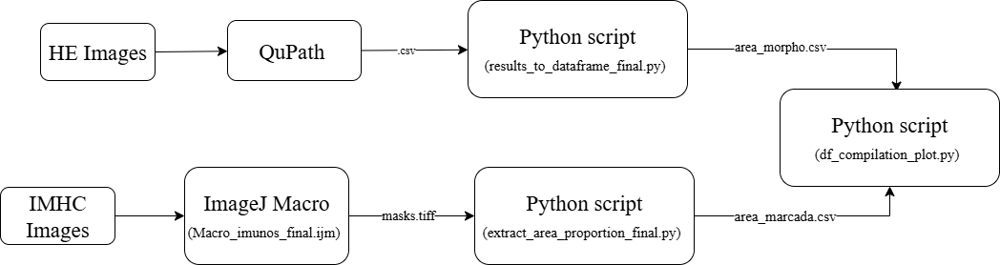

<div align="center">   

# Gene expression and Histomorphology in the Uterosacral Ligament
</div>

<h3 align="center">
  <a href="">Paper Link*</a> |
  <a href="https://github.com/ana-caznok/Histomorphology_Analysis/blob/main/Poster%20ICS%20Hoxa11.pdf">Poster ICS</a> |
  <a href="https://github.com/ana-caznok/Histomorphology_Analysis/blob/main/Poster%20CBGO%5B1%5D.pdf">Poster GBO</a>
</h3>

<br><br>

## Table of Contents:
1. [Research Overview](#overview)
2. [Methodology Overview](#methodology)
3. [Getting Started](#start)

## Research Overview <a name="overview"></a>
This is the github repository for article: Principal Component Analysis of Uterosacral Ligaments and HOXA-11 Protein Quantification in Women with Pelvic Organ Prolapse. 

Pelvic organ prolapse (POP) results from the failure of the support mechanisms of the pelvic viscera, resulting in vaginal protrusion and the fall of the pelvic organs through the vaginal canal. The pathophysiology of genital prolapse is multifactorial, in which environmental factors such as lifestyle, parity, and childbirth interact with molecular, endocrine, and genetic factors. The uterosacral ligaments (USL) are composed of collagen, smooth muscle, elastin and nerve bundles. On POP there are histomorphological changes characterized by decreased smooth muscle content, decreased cellularity, alterations in the extracellular matrix (ECM), increased apoptosis, increased inflammation and increased adipocytes. The ECM dysfunction is characterized by alterations in metabolism and distribution of the main proteins, like changes in the proportions of collagen subtypes. 
Hoxa11 is responsible for development of the female reproductive system and formation of uterosacral ligaments, lower uterine segment, and cervix, and also acts in collagen type III synthesis and matrix metalloproteinase 2 (MMP2) synthesis. HOXA11 regulates morphology and integrity of USLs by promoting cell proliferation and attenuating apoptosis and also regulating extracellular matrix homeostasis. Studies have shown reduced expression of HOXA11 associated with reduced expression of collagens, ECM disfunction and low cellularity in women with POP. 
It is our hypothesis that due to the low expression of HOXA11 in women with prolapse, there are changes in the uterosacral ligament, as well as the organization of the connective tissue, proportion of smooth muscle and cellularity. Therefore, the objective of this study is to analyze the expression of the HOXA11 gene and its association with the histomorphological alterations in the uterosacral ligament in women with pelvic organs. 
<p align="left">
  
  <br>
  <em>Figure 1: Overview of Methodology</em>
</p> 

## Methodology Overview <a name="methodology"></a>
The computational methodology was divided into three parts: a histomorphological quantification, a immunohistochemical quantification and joining both information into a single dataframe that allows PCA analysis. 
<p align="left">
  
  <br>
  <em>Figure 2: Overview of Computational Workflow</em>
</p> 


### 1. Histomorphology (QuPath → Python)
- Hematoxylin & Eosin (HE) histopathological images were annotated in QuPath.  
- QuPath exported measurements as `.csv` files, one per image, inside a folder:
  ```
  <base_path>/database_csvs/
  ```
- These CSVs are then aggregated by patient using:
  ```bash
  python results_to_dataframe_final.py <base_path>
  ```
- **Main output**:
  ```
  <base_path>/morpho_results/area_morpho.csv
  ```
  → patient-level areas and % of tissues (loose connective, adipose, muscle, dense connective).

---

### 2. Gene Expression (IHC via ImageJ → Python)
- Immunohistochemistry images were analyzed with the ImageJ macro:

  ```
  Macro_Imunos_final.ijm
  ```

  This macro creates **binary mask images** for each IHC-stained slide.

- The Python script `extract_area_proportion_final.py` then walks through the mask folder, counts **positive vs total pixels**, and exports:

  ```bash
  python extract_area_proportion_final.py <imuno_masks_folder> --threshold 0 --pixel-size-um 0.325
  ```

- **Main output**:
  ```
  <imuno_masks_folder>/area_imunos_marcadas.csv
  ```

  → with per-image area in pixels², %, and optionally µm².

---

### 3. Joining Information
- The morphometry and immuno tables can be merged with optional **clinical metadata** (e.g., age, BMI).
- This is done using:
  ```bash
  python df_compilation_plot_final.py <base_path>
  ```
- **Main outputs**:
  - `<base_path>/final_results/final_measurements_table.csv` → merged tidy table  
  - `<base_path>/final_results/final_measurements_table_pop.csv` → subset (CASE/POP only)  
  - `<base_path>/final_results/stats_table.csv` → per-type averages  
  - `<base_path>/final_results/plots/*.png` → saved plots:
    - Average tissue proportions
    - Grouped regression plots (e.g., % tissue vs Age, BMI)
    - Violin & boxplots by type
    - PCA loadings heatmap
    - PCA 2D projection

---

## Required Folder Organization

```
<base_path>/
├── database_csvs/               # QuPath exported .csvs per image
├── morpho_results/              # created automatically by script
├── imuno_results/               # should contain area_imunos_marcadas.csv (from ImageJ masks)
├── final_results/               # plots and final merged tables
└── (optional) Planilha_final_04-02.csv   # clinical metadata
```

---

## Installation

Clone this repository and install requirements:

```bash
git clone <your-repo-url>
cd <your-repo-name>
pip install -r requirements.txt
```

**requirements.txt** includes:
```
numpy
pandas
pillow
matplotlib
seaborn
scipy
scikit-learn
```

---

## Running the Workflow

1. **QuPath annotations** → export `.csv` into `<base_path>/database_csvs/`
2. **Aggregate morphometry**:
   ```bash
   python results_to_dataframe_final.py <base_path>
   ```
   → outputs `<base_path>/morpho_results/area_morpho.csv`

3. **ImageJ macro**:
   - Run `Macro_Imunos_final.ijm` in ImageJ/Fiji.
   - Save resulting masks into `<imuno_masks_folder>`.

4. **Extract immuno mask areas**:
   ```bash
   python extract_area_proportion_final.py <imuno_masks_folder> --threshold 0 --pixel-size-um 0.325
   ```
   → outputs `<imuno_masks_folder>/area_imunos_marcadas.csv`

5. **Join datasets & generate plots**:
   ```bash
   python df_compilation_plot_final.py <base_path>
   ```
   → saves merged tables + all plots in `<base_path>/final_results/`

---

## Outputs at a Glance

- **Morphometry (per patient)** → `area_morpho.csv`  
- **IHC quantification (per image)** → `area_imunos_marcadas.csv`  
- **Merged table** → `final_measurements_table.csv`  
- **Stats summary** → `stats_table.csv`  
- **Plots** → `.png` files inside `final_results/plots/`
